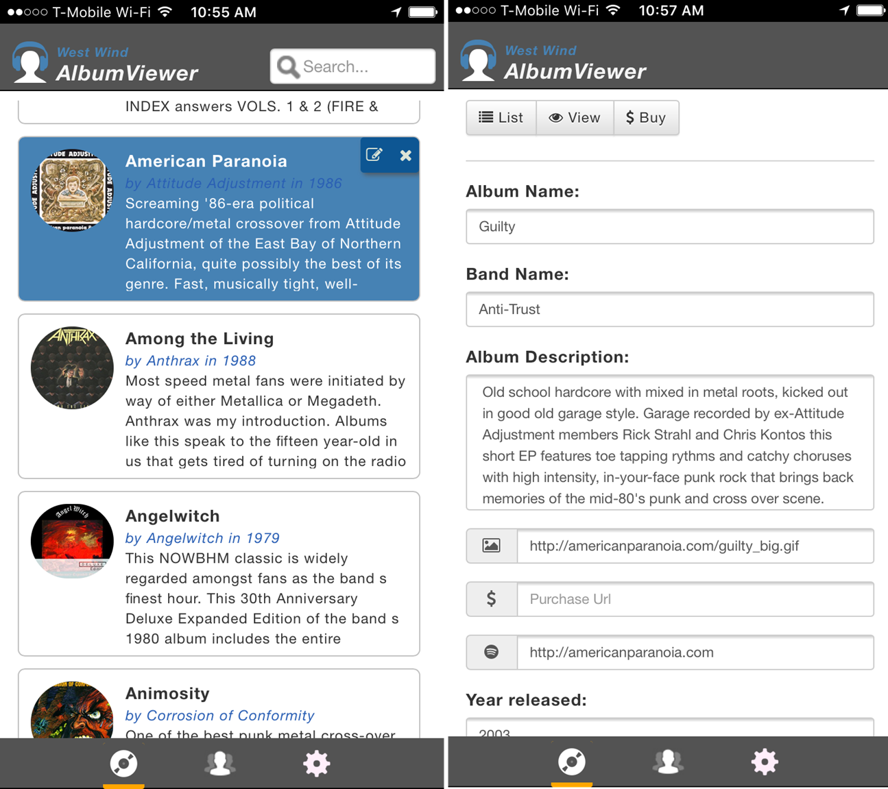

# West Wind Album Viewer ASP.NET Core Sample

**Sample Angular (4) application demonstrating ASP.NET Core API features**

This is a sample ASP.NET Core application that demonstrates basic features of ASP.NET Core in an API backend application with an Angular frontend. The application allows browsing and editing of a list of albums and artists interactively.


In a Mobile Web Browser: 



**Online Sample:**
* [Live AlbumViewer Sample](https://samples.west-wind.com/AlbumViewerCore/)

### ASP.NET Core Features
The **ASP.NET Core** Backend demonstrates:

* Creating an API backend service
* Isolating business logic and Controller code
* Using a base Repository for business logic
* Separating code into separate projects
* Custom User Authentication
* CORS Support
* Using ASP.NET Core as a backend to an Angular 2.0 front end

The sample also includes a few Server Side Rendered MVC pages for browsing and viewing of albums and artists. I'll be adding the edit pages at a later point.

Version supported:  
* **.NET Core 1.1.1**
* **1.0.1 SDK Version**
* **Visual Studio 2017 (.csproj)**

> #### Visual Studio 2015
> If you're using Visual Studio 2015, you need to use the `Last.NET1.01Version` Git tag to retrieve the last version that uses Visual Studio 2015 and the `.xproj`/`project.json` format. All newer builds use Visual Studio 2017 and the new `.csproj` style format.

### Angular Features
The **Angular** front end application demonstrates:

* Page based Application
* Mobile friendly, adaptive UI
* Routing
* Animations and Page Transitions
* Client side and server side Authentication tracking
* Client side and server side Validation
* Managing Server Urls (dev/production)
* Angular CLI Project

Version supported:  
* **Angular 4.0**  
* **Angular CLI 1.0**


### Getting Started ###
You should just be able to clone this repo as is on either Windows or Mac (and probably Linux) and do:

```
cd <Base Solution Folder>
dotnet restore
cd .\src\AlbumViewerNetCore
dotnet run
```

Then navigate to [http://localhost:5000](http://localhost:5000) to start the application. First launch might fail due a timeout due to the initial DB creation, but subsequent requests should work.

If you're running the application locally through IIS or Kestrel, the application should just work as is. By default it uses a SqLite data base that is created in the Web app's content (not Web) root. 

The sample also works with SQL Server but you have to create the database for that to work and set the connection string in `appsettings.json`. 


To switch between SqLite and Sql Server use the `useSqlLite` configuration settings:

```json
  "Data": {
    "AlbumViewer": {
      "useSqLite": "true",
      "SqlServerConnectionString": "server=.;database=AlbumViewer;integrated security=true;",
    } 
  },
  //... other settings omitted
}
```  

In either case initial albums/artist data should auto-create the first time the app is run.

##### Using SqLite
SqLite will automatically create the database file in the content content root of the project (same folder as project.json). For this to work make sure that the account the Web application is running under has appropriate rights to create a new file and read/write to that file in the content folder.

##### Using Sql Server
To use Sql Server create a new empty database and then point the connection string at the new database. Make sure the account the Web server is running under has rights to create tables and then read/write data.

#### To develop the AlbumViewer Angular 2 example
The Angular front end sits in a separate AlbumViewerAngular project folder and is built separately from the ASP.NET Core application.

The sample however, does ship with pre-compiled .js files for the sample that have been copied into the Web project's **wwwroot** folder so the application will just run through IIS Express/IIS or Kestrel.


Making changes to the Angular 2.0 application requires transpiling of the typescript source files. In order to make changes to the Angular 2 client sample run the following from a command window:

```
cd <installFolder>\src\AlbumViewerAngular
npm install
ng serve
```

then navigate to **http://localhost:4200** to run the application. Note this uses the WebPack development server rather than running through IIS Express or Kestrel for the front end assets - index.html, all css, images etc. are served from the development server and only API requests go through Kestrel/IIS.

Depending on which port you run the ASP.NET Core application you may have to change the API server base URL which defaults to **http://localhost:5000/** in the `app/business/appConfiguration.ts` file. The default is when running the development server that requests are routed to **http://localhost:5000/** which is where Kestrel runs by default.

Once you've made your changes, you need to build the application's final output. Run:

```
npm run build:prod
```

which creates the final transpiled bundles you can use to run your application through the ASP.NET Core application.

I've changed the default output folder in `angular-cli.json` from the `.\dist` folder to the ASP.NET `wwwroot` folder so that the application can run entirely served by Kestrel or IIS. It also still works using `ng serve` which uses whatever path is used in `angular-cli.json`.

#### Platforms 
Currently the app has been tested to run under Windows and Mac, but it should also work under Linux.

**License:**  
This sample is licensed under MIT license. Use, play with, integrate code from
this repository as you see fit at your own risk. I try to update this code regularly to reflect the latest current builds of ASP.NET Core and Angular.

**Warranty Disclaimer: No Warranty!**

IN NO EVENT SHALL THE AUTHOR, OR ANY OTHER PARTY WHO MAY MODIFY
AND/OR REDISTRIBUTE THIS PROGRAM AND DOCUMENTATION, BE LIABLE 
FOR ANY COMMERCIAL, SPECIAL, INCIDENTAL, OR CONSEQUENTIAL DAMAGES
ARISING OUT OF THE USE OR INABILITY TO USE THE PROGRAM INCLUDING, 
BUT NOT LIMITED TO, LOSS OF DATA OR DATA BEING RENDERED INACCURATE
OR LOSSES SUSTAINED BY YOU OR LOSSES SUSTAINED BY THIRD PARTIES OR
A FAILURE OF THE PROGRAM TO OPERATE WITH ANY OTHER PROGRAMS, EVEN
IF YOU OR OTHER PARTIES HAVE BEEN ADVISED OF THE POSSIBILITY OF 
SUCH DAMAGES.
